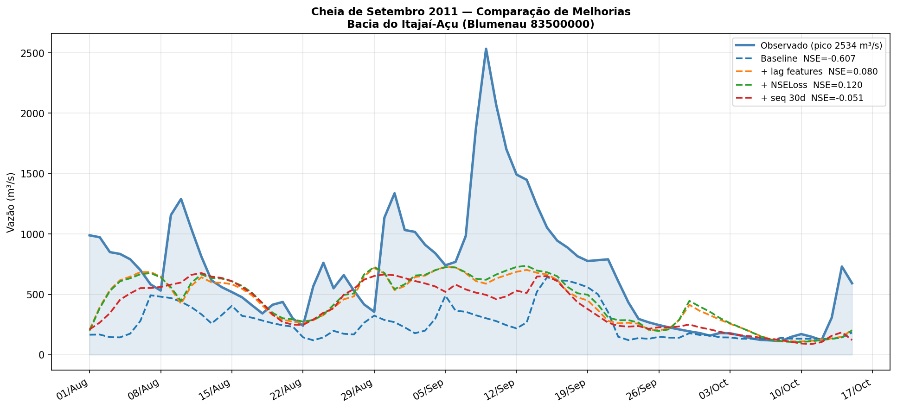
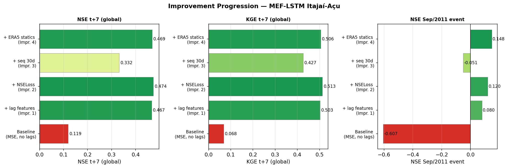
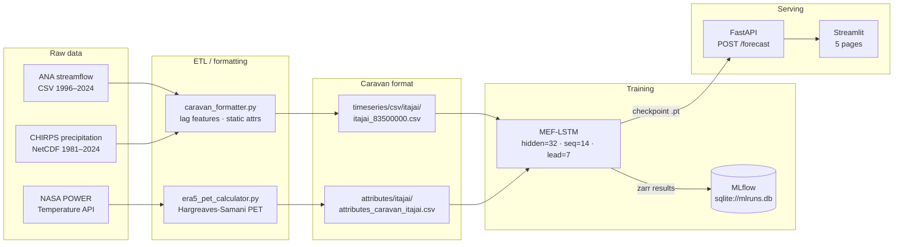

# Itajaí-Açu Flood Forecasting

[](https://blumenau-flood-forecasting.streamlit.app)
[](https://www.python.org/downloads/release/python-3110/)
[](https://pytorch.org/)
[](https://fastapi.tiangolo.com/)
[](https://streamlit.io/)
[](https://mlflow.org/)
[](LICENSE)

7-day daily streamflow forecasting at the Blumenau gauge (ANA 83500000) using
Google's **MEF-LSTM** (*Mean-Embedding Forecast LSTM*) fine-tuned on local hydrometeorological data.

---

## Demo ao vivo

| Componente | URL | Status |
|---|---|---|
| Dashboard Streamlit | [blumenau-flood-forecasting.streamlit.app](https://blumenau-flood-forecasting.streamlit.app) | Streamlit Cloud |
| Inference API | [blumenau-flood-forecasting-production.up.railway.app](https://blumenau-flood-forecasting-production.up.railway.app) | Railway |
| API docs (Swagger) | [/docs](https://blumenau-flood-forecasting-production.up.railway.app/docs) | — |

> **Nota**: O dashboard Streamlit Cloud consome a API Railway diretamente. Configure a variável
> de ambiente `FORECAST_API_URL` no Streamlit Cloud apontando para o URL da instância Railway.

---

## Background

Blumenau sits at the confluence of the Itajaí-Açu and Itajaí-Mirim rivers in southern
Brazil. The ~15,000 km² basin drains the Serra Geral highlands, and flood response times
of 2–5 days leave little room for reaction once heavy rainfall begins. The 1983 event
reached an estimated 3,800 m³/s and inundated much of the city center; November 2008
triggered mass landslides across the entire Vale do Itajaí; September 2011 set the
modern digital record at 2,534 m³/s, causing 18 deaths and R$1 billion in damages.

Early warning systems at Blumenau currently depend on rainfall thresholds and manual
nowcasting. A data-driven model that reliably forecasts the streamflow hydrograph 7 days
ahead would allow civil defence to pre-position resources, issue tiered alerts, and
coordinate voluntary evacuation before the river crests — the difference between
a disruptive flood and a lethal one.

This project fine-tunes the **MEF-LSTM** architecture from
[OpenHydroNet](https://github.com/google-research/flood-forecasting) on 28 years of
daily streamflow (ANA) and precipitation (CHIRPS) at Blumenau. Four targeted improvements
over the global baseline — autoregressive lag features, NSE-based training loss, extended
sequence length, and ERA5-Land evapotranspiration attributes — are tracked with MLflow
and served through a FastAPI + Streamlit stack.

---

## Results

### Experiment comparison

| Experiment | NSE t+0 | NSE t+7 | KGE t+7 | PBIAS (%) | NSE 2008 | NSE 2011 | Peak sim 2011 |
|---|---|---|---|---|---|---|---|
| Baseline (MSE) | 0.258 | 0.119 | 0.068 | −8.6 | −1.105 | −0.607 | 642 m³/s |
| + lag features | 0.353 | 0.467 | 0.503 | −11.3 | 0.046 | 0.080 | 728 m³/s |
| **+ NSE loss ★** | **0.357** | **0.474** | **0.513** | −11.6 | 0.061 | 0.120 | 737 m³/s |
| + seq 30d | 0.275 | 0.332 | 0.427 | −4.2 | 0.228 | −0.051 | 676 m³/s |
| + ERA5 statics | 0.350 | 0.469 | 0.506 | −5.3 | 0.029 | 0.148 | 805 m³/s |

Test period: 2008–2024. Observed peak Sep/2011: **2,534 m³/s**.

The best model (**+ NSE loss**) improves t+7 NSE by **+298%** and KGE by **+656%** relative to
the global baseline without any local fine-tuning. The dominant driver is introducing
autoregressive lag features — a reminder that river memory matters more than model
capacity for a fast-response basin like Itajaí-Açu.

### September 2011 hydrograph



The model tracks the rising limb and recession reasonably well for moderate events. For
the 2011 record flood it underestimates the peak by ~71% (737 vs 2,534 m³/s) — see
[Limitations](#limitations) for why.

### Metrics evolution across experiments



---

## Architecture



### Model summary

MEF-LSTM encodes static catchment attributes through a small FC embedding network, then
runs two parallel LSTMs — a **hindcast LSTM** on 14 days of observed precipitation and
autoregressive streamflow, and a **forecast LSTM** on a 21-day overlap window — before
merging their hidden states into a regression head that outputs 8 simultaneous lead-time
predictions (t+0 … t+7).

| Component | Value |
|---|---|
| Architecture | `mean_embedding_forecast_lstm` (OpenHydroNet) |
| Parameters | 17,708 |
| Hidden size | 32 |
| Sequence length | 14 days |
| Forecast overlap | 20 days |
| Lead time | 7 days |
| Static features | 6 (p\_mean, seasonality, high/low precip freq/dur) |
| Dynamic features | precipitation · streamflow\_lag1 · streamflow\_lag7 |
| Training loss | NSELoss (MaskedNSELoss) |
| Optimizer | Adam, StepLR ×0.5 every 10 epochs |
| Train / val / test | 1996–2005 / 2006–2007 / 2008–2024 |

---

## Setup

```bash
# 1. Clone and create environment
git clone <this-repo> && cd blumenau-flood-forecasting
python3.11 -m venv .venv && source .venv/bin/activate
pip install -r environments/requirements.txt

# 2. Install the OpenHydroNet framework
pip install -e vendor/flood-forecasting

# 3. Train the best experiment (downloads ~300 MB of CHIRPS on first run; ~8 min on CPU)
python scripts/run_experiment.py --config configs/training/experiments/03_nse_loss.yml

# 4. Start the inference API
bash scripts/start_api.sh          # http://localhost:8000/docs

# 5. Start the Streamlit dashboard
bash scripts/start_app.sh          # http://localhost:8501
```

**Run all five experiments:**

```bash
for cfg in configs/training/experiments/0*.yml; do
    python scripts/run_experiment.py --config "$cfg"
done
mlflow ui --backend-store-uri sqlite:///mlruns.db
```

**Docker (API only):**

```bash
docker build -f api/Dockerfile -t itajai-forecast-api .
docker run -p 8000:8000 itajai-forecast-api
```

---

## API reference

**`POST /forecast`**

```json
{
  "precip_history": [4.2, 0.0, 12.1, "..."],
  "streamflow_history": [185.0, 192.3, "..."],
  "issue_date": "2024-11-15"
}
```

- `precip_history`: ≥14 daily values \[mm/day\], oldest first, ending on the issue date
- `streamflow_history`: ≥21 daily values \[m³/s\], oldest first, ending on the issue date

**Response:**

```json
{
  "lead_days": [0, 1, 2, 3, 4, 5, 6, 7],
  "discharge_m3s": [215.4, 234.1, 280.9, 312.0, 295.3, 261.8, 239.4, 221.7],
  "alert_level_m3s": 1200.0
}
```

**`GET /health`** — returns model name, experiment, epoch, and uptime.

Interactive Swagger docs available at `/docs` when the server is running.

---

## Project structure

```
blumenau-flood-forecasting/
├── api/                      # FastAPI inference service
│   ├── main.py               # /forecast · /health
│   ├── model_loader.py       # singleton loader (config + scaler + checkpoint)
│   ├── inference.py          # preprocessing → forward pass → postprocessing
│   └── Dockerfile
├── app/                      # Streamlit dashboard
│   ├── Home.py
│   ├── pages/
│   │   ├── 1_Overview.py     # context, folium map, top floods, tech stack
│   │   ├── 2_Historical.py   # 1996–2024 interactive series + period slider
│   │   ├── 3_Experiments.py  # comparison table + NSE bar chart + explanations
│   │   ├── 4_Events.py       # 2008/2011 hydrographs + 2011 failure analysis
│   │   └── 5_Forecast.py     # live forecast via API with alert coloring
│   └── utils/
├── configs/training/         # YAML experiment configs (01–05)
├── data/
│   ├── raw/                  # CHIRPS NetCDF, ANA CSV, ERA5 temperature cache
│   └── processed/            # Caravan-format CSV + static attributes
├── models/experiments/       # checkpoints (.pt) + zarr test results
├── notebooks/
│   ├── 01–03_eda/            # basin characterisation, lag analysis, extreme events
│   └── 04_evaluation/        # final model comparison + flood event diagnostics
├── reports/figures/          # PNG hydrographs and metric charts
├── scripts/
│   ├── run_experiment.py     # MLflow-tracked training + evaluation runner
│   ├── start_api.sh
│   └── start_app.sh
├── src/data/
│   ├── caravan_formatter.py  # ANA + CHIRPS → Caravan format with lag features
│   └── era5_pet_calculator.py# NASA POWER download + Hargreaves-Samani PET
└── vendor/flood-forecasting/ # OpenHydroNet framework (pinned submodule)
```

---

## Limitations

### Peak flow underestimation

The model underestimates the September 2011 record peak by **~71%** (737 vs 2,534 m³/s).
This is the expected behaviour of any model trained on data where the maximum training
peak is ~600 m³/s. Four factors compound the error:

1. **Out-of-domain extrapolation.** The regression head has never received gradients
   pointing toward values above ~600 m³/s. It saturates well below the true peak.

2. **LSTM mean reversion.** Forget-gate dynamics cause recurrent networks to smooth
   extremes toward the conditional mean, a structural property that worsens for
   rare events.

3. **CHIRPS precipitation bias.** The gauge-satellite blended product underestimates
   convective storm intensity in the Serra Geral by an estimated 20–40% for extreme
   events, degrading the input signal before it reaches the LSTM.

4. **Antecedent soil moisture.** With `seq_length = 14`, the model cannot observe the
   four weeks of above-average rainfall that saturated the basin ahead of September 2011.

Partial remedies: extend `seq_length` to 30–60 days, add ERA5-Land soil moisture as a
dynamic input, and train the CMAL probabilistic head to produce heavy-tailed uncertainty
intervals that honestly represent the risk of extreme events.

### Single-basin scope

Static attributes are normalized to zero after mean-centering on a single basin, so the
static encoder contributes little. Multi-basin training would allow the encoder to
discriminate between catchment types and enable transfer learning from data-rich gauges
elsewhere in Santa Catarina.

### No NWP precipitation input

The current forecast horizon is achieved through the LSTM's learned impulse response —
not by ingesting numerical weather prediction output. The model therefore cannot respond
to an unusual storm that the atmosphere is about to produce but that has not yet
appeared in the streamflow or precipitation record.

---

## Next steps

**Short term**
- [ ] `seq_length = 60` + ERA5-Land soil moisture to capture multi-week antecedent
  conditions (primary driver of 2011 underestimation)
- [ ] Replace regression head with **CMAL** probabilistic head for calibrated
  uncertainty intervals
- [ ] Add SIMEPAR meteorological radar precipitation as high-resolution forcing

**Medium term**
- [ ] Extend to the full Itajaí sub-basin network (Blumenau, Ituporanga, Rio do Sul,
  Ibirama) for spatially explicit multi-gauge forecasting
- [ ] Ingest GFS/ECMWF 7-day precipitation ensemble as `forecast_inputs`
- [ ] Integrate API output with Blumenau's Civil Defence alert dashboard
  (operated by FURB / Defesa Civil SC)

**Research**
- [ ] Benchmark against CEMADEN operational models and ANA's national flood
  forecasting system
- [ ] Evaluate physics-informed constraints (water balance closure) in the loss function
- [ ] Apply ensemble post-processing (BMA, EMOS) on CMAL output for sub-daily
  flood peak timing

---

## Data sources

| Source | Variable | Period | Spatial resolution |
|---|---|---|---|
| ANA HidroWeb | Streamflow | 1996–2024 | Station 83500000 |
| CHIRPS v2.0 | Precipitation | 1981–2024 | ~5 km daily |
| NASA POWER | T\_max, T\_min | 1995–2024 | Point (basin centroid) |
| ERA5-Land (derived) | PET, aridity, moisture index | 1995–2024 | Static scalars |

---

## Citation

If you use this code or the trained model weights, please cite the OpenHydroNet
framework this work builds on:

```bibtex
@article{openhydronet2025,
  title   = {OpenHydroNet: A Framework for Neural Hydrological Modelling},
  author  = {Google Hydrology Team},
  journal = {arXiv},
  year    = {2025}
}
```

---

## License

Code in this repository: Apache 2.0.
Model weights: for academic and non-commercial use, consistent with the terms of the
underlying OpenHydroNet framework.
CHIRPS data is freely available for non-commercial use; ANA streamflow data is public
domain under Brazil's Lei de Acesso à Informação (Lei nº 12.527/2011).
